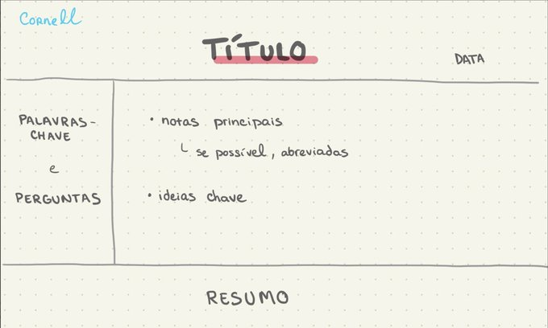
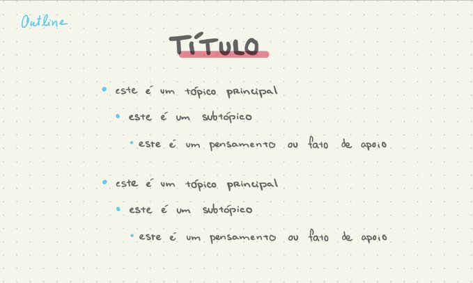
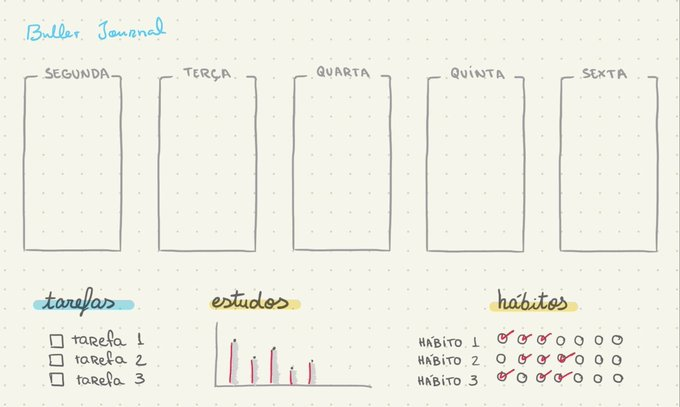
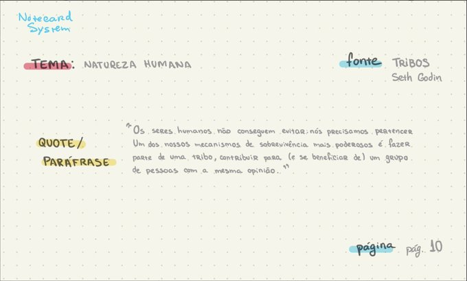
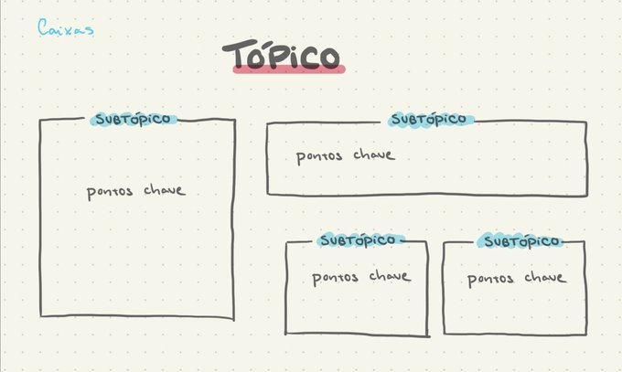
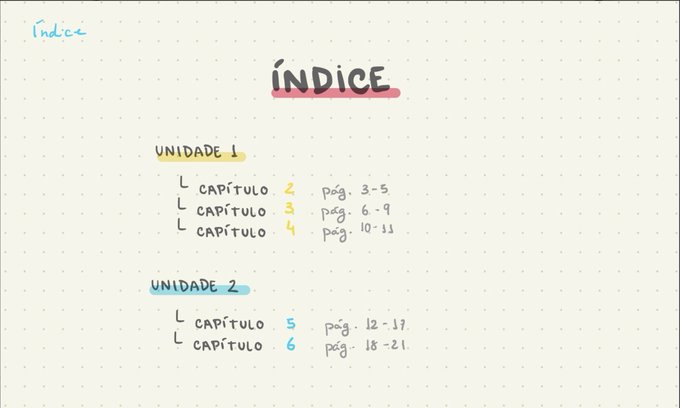
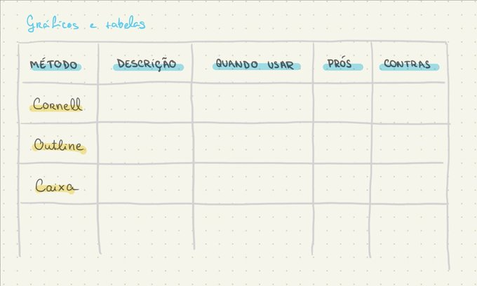
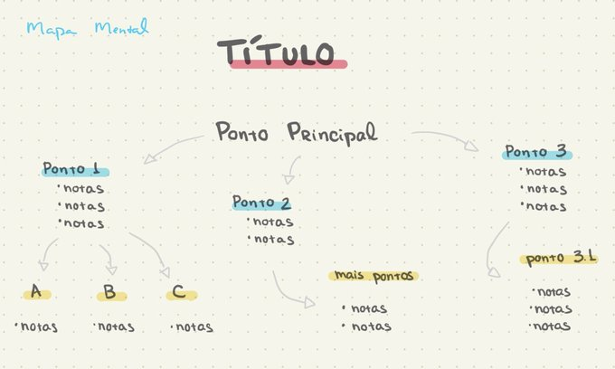

# Planos de estudos

Como construir um bom plano para estudar qualquer coisa.

# Plano de Estudo sobre XXXXXX

### Objetivo de aprendizagem
Objetivos seguindo a taxonomia de bloom
### Explorar o tema
O que você deseja descobrir a partir dos objetivos
### Palavras chaves
Palavras chaves que surgem a partir do que você deseja descobrir e dos objetivos
### Onde pesquisar
Dado o nível dos objetivos, onde podemos pesquisar? Google, artigos, livros, aulas, youtube. 

### Entendimento básico

### Como você pode recuperar ?
Quais são as estrátegias que podem ser utilizadas para recuperar o conhecimentos, quando falamos em recuperar é estratégias para lembrar o conhecimento

## Valide seu conhecimento
Como você pode validar se seu conhecimento está correto? 

### Exercícios e atividade de validação de contexto
Quais seriam os exercicios e atividades que as pessoas poderiam fazer para validar o conhecimento. 
Aqui é para deixar o exemplo do exercício. 

### Pessoas que são autoridade sobre o tema
Quem são as pessoas que você seguiria nas redes sociais para saber mais sobre o tema?

### Fontes de consumo fácil
QUais seriam as fontes que uma pessoa pode relembrar ou aprender com facilidades sobre o assunto

### Tecnicas de anotação

#### Método de Cornel

#### Método Outline

#### Bullet journal 

#### Notecard system

#### Método das Caixas

#### Índice

#### Gráficos e Tabelas

#### Mapa Mental
